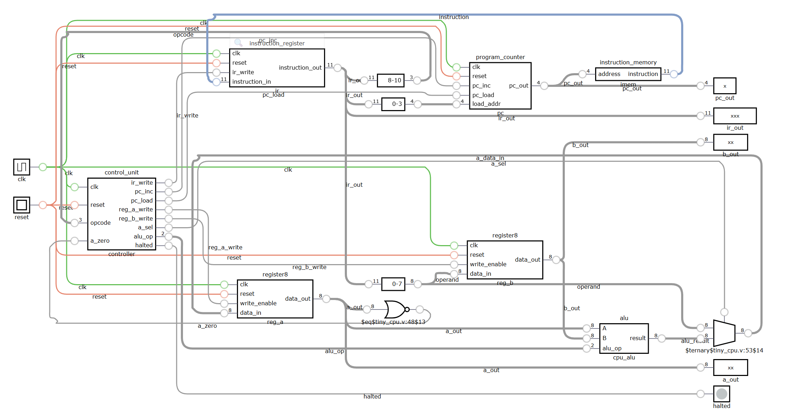

# Tiny 8-bit Multicycle CPU

A small CPU implemented in Verilog to understand how a processor is
built from basic RTL components. The design uses an **8-bit datapath**,
**11-bit instructions**, a **4-bit program counter**, and a simple
**FETCH → EXECUTE → HALTED** control FSM.

## Architecture




### Main Components

-   **Program Counter (PC)** --- 4-bit instruction address; supports
    increment and jump loading.
-   **Instruction Memory** --- 16 × 11-bit combinational ROM containing
    the program.
-   **Instruction Register (IR)** --- stores the currently executing
    instruction.
-   **Control Unit** --- FSM that generates register, ALU, PC, and IR
    control signals.
-   **A / B Registers** --- two 8-bit datapath registers.
-   **ALU** --- performs ADD, SUB, and AND.
-   **Top-Level CPU** --- connects the complete datapath and control
    logic.

## Instruction Format

``` text
[10:8]  Opcode
[7:0]   Operand
```
| Opcode | Instruction | Operation |
|--------|-------------|-----------|
| `000` | LOAD A | `A ← immediate` |
| `001` | LOAD B | `B ← immediate` |
| `010` | ADD | `A ← A + B` |
| `011` | SUB | `A ← A - B` |
| `100` | AND | `A ← A & B` |
| `101` | JMP | `PC ← operand[3:0]` |
| `110` | JZ | Jump if `A == 0` |
| `111` | HALT | Stop execution |

## Execution

Each instruction normally takes two clock cycles:

``` text
FETCH:
    IR ← InstructionMemory[PC]
    PC ← PC + 1

EXECUTE:
    Decode IR
    Perform the requested operation
```

The instruction register keeps the fetched instruction stable while the
PC moves to the next address.

## Project Structure

``` text
tiny_cpu/
├── rtl/
│   ├── alu.v
│   ├── control_unit.v
│   ├── instruction_memory.v
│   ├── instruction_register.v
│   ├── program_counter.v
│   ├── register8.v
│   └── tiny_cpu.v
├── tb/
│   └── *_tb.v
├── docs/
│   └── tiny_cpu_architecture.png
├── build/
└── waveforms/
```

## Verification

The CPU is verified using Verilog testbenches with **Icarus Verilog**
and waveform inspection using **GTKWave**.

Testing is performed at two levels:

1.  Individual module testbenches.
2.  Full CPU integration testbench.

Python/cocotb is not required for a design of this size. It can be added
later for randomized tests or larger automated regressions.

Example:

``` bash
iverilog -g2012 -s tiny_cpu_tb -o build/tiny_cpu_sim \
  rtl/alu.v rtl/register8.v rtl/program_counter.v \
  rtl/instruction_memory.v rtl/instruction_register.v \
  rtl/control_unit.v rtl/tiny_cpu.v tb/tiny_cpu_tb.v

vvp build/tiny_cpu_sim
gtkwave waveforms/tiny_cpu.vcd
```

## Current Capabilities

-   8-bit arithmetic datapath
-   16 instruction addresses
-   Immediate loads
-   ADD, SUB, AND
-   Unconditional jump
-   Conditional zero jump
-   HALT state
-   Modular RTL design
-   Functional simulation and waveform verification

## Future Improvements

The current CPU is intentionally minimal. Possible extensions include:

-   **Data memory** with LOAD/STORE instructions.
-   **Single-cycle CPU** to compare CPI against the current multicycle
    design.
-   **Pipelining** to overlap instruction execution.
-   **General-purpose register file** instead of only A and B.
-   **Larger ALU/ISA** with shifts, OR, XOR, multiply, flags, and
    additional addressing modes.
-   **Static timing analysis** to determine the critical path and
    maximum clock frequency.
-   **FPGA implementation** for execution on real hardware.
-   **Processing-in-memory / near-memory compute** to compare
    conventional CPU data movement against local memory-side
    computation.
-   **ML accelerator extension** using SRAM, parallel MAC units, and
    weight/activation buffers.

## Goal

This project provides a small, understandable CPU baseline that can be
progressively extended toward more advanced computer architecture and ML
accelerator designs.
