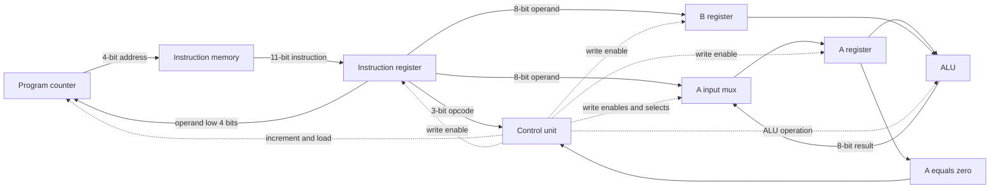
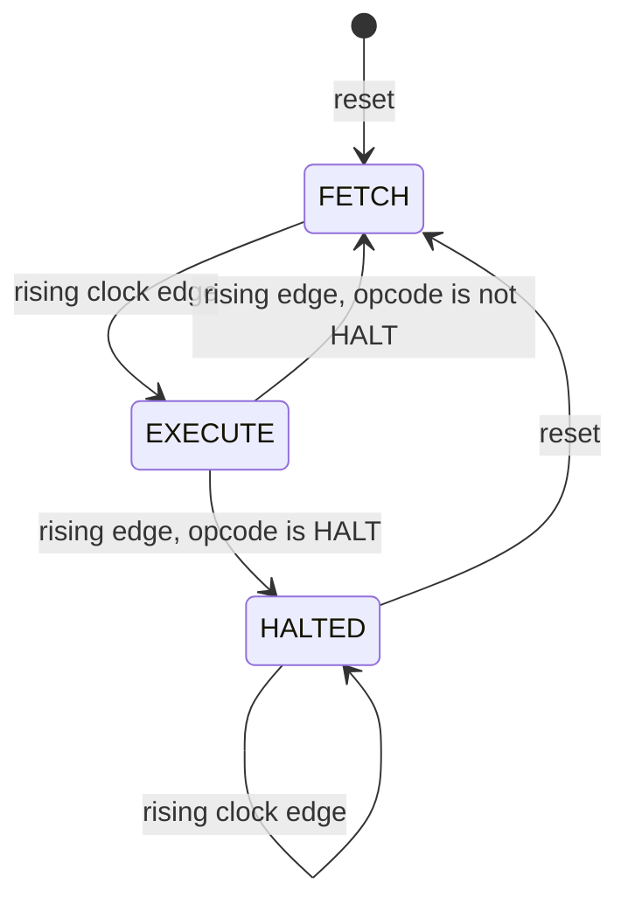

# Tiny CPU component guide

This guide describes the current Verilog implementation, from individual storage
and logic blocks to the execution of the complete 16-instruction ROM program.
All source links are relative to this document.

## Contents

- [Architecture and instruction format](#architecture-and-instruction-format)
- [Clock, reset, and storage](#clock-reset-and-storage)
- [Program counter](#program-counter)
- [Instruction memory](#instruction-memory)
- [Instruction register](#instruction-register)
- [A and B registers](#a-and-b-registers)
- [Arithmetic logic unit](#arithmetic-logic-unit)
- [Control unit](#control-unit)
- [Top-level connections](#top-level-connections)
- [Instruction execution](#instruction-execution)
- [Complete program walkthrough](#complete-program-walkthrough)
- [Verification and waveforms](#verification-and-waveforms)

## Architecture and instruction format

The CPU has an 8-bit datapath and two data registers, A and B. Arithmetic and
logic instructions write their result into A, so A acts as an accumulator.
A 4-bit program counter selects one of 16 instructions. There is no data RAM,
stack, register file, or external memory interface.

Each instruction is 11 bits wide:

```text
 10       8 7                         0
+----------+---------------------------+
|  opcode  |          operand          |
+----------+---------------------------+
   3 bits              8 bits
```

| Opcode | Instruction | Operation during EXECUTE | Operand use |
| --- | --- | --- | --- |
| `000` | LOAD A | `A ← operand` | All 8 bits are an immediate value |
| `001` | LOAD B | `B ← operand` | All 8 bits are an immediate value |
| `010` | ADD | `A ← A + B` | Ignored |
| `011` | SUB | `A ← A - B` | Ignored |
| `100` | AND | `A ← A & B` | Ignored |
| `101` | JMP | `PC ← operand[3:0]` | Low 4 bits are an absolute address |
| `110` | JZ | If `A == 0`, `PC ← operand[3:0]` | Low 4 bits are an absolute address |
| `111` | HALT | Enter HALTED | Ignored |

LOAD instructions load constants embedded in the instruction; they do not read
data memory. ADD and SUB retain only the low 8 result bits.



Solid arrows show data or status paths; dotted arrows show controls. Clock and
reset connections are omitted from the diagram for readability.

## Clock, reset, and storage

The PC, IR, A, B, and controller state are sequential logic. They update on the
rising edge of `clk`, and all use an active-high asynchronous `reset`:

```verilog
always @(posedge clk or posedge reset)
```

Asserting reset clears PC, IR, A, and B immediately in simulation and puts the
controller in FETCH. Reset takes priority over every write or increment request.
Deasserting reset alone does not execute an instruction; execution starts at the
next rising clock edge.

Sequential assignments use `<=` (nonblocking assignment). At a shared clock
edge, each block uses the values present before the edge. This lets the IR
capture the instruction at the old PC while the PC increments at that same edge.

The ROM, ALU, instruction decoding, A input mux, zero detector, and controller
output/next-state logic are combinational. Their outputs follow their inputs
without waiting for a clock edge. A Verilog `reg` declaration does not by itself
mean a hardware register: for example, the ALU's `result` is assigned in an
`always @(*)` block and represents combinational logic.

## Program counter

Source: [rtl/program_counter.v](../rtl/program_counter.v)

The PC stores the address used to read instruction memory.

| Port | Direction | Width | Purpose |
| --- | --- | --- | --- |
| `clk` | Input | 1 | Rising-edge clock |
| `reset` | Input | 1 | Asynchronously clear PC to 0 |
| `pc_inc` | Input | 1 | Request increment |
| `pc_load` | Input | 1 | Request jump address load |
| `load_addr` | Input | 4 | Address to load |
| `pc_out` | Output | 4 | Stored instruction address |

The update priority is:

1. If reset is high, clear PC to 0.
2. Otherwise, at a rising edge, load `load_addr` if `pc_load` is high.
3. Otherwise, increment if `pc_inc` is high.
4. Otherwise, retain the current address.

Load has priority if both control inputs are asserted. Increment is modulo 16,
so address 15 increments to 0. FETCH increments the PC; an ordinary EXECUTE
cycle holds it. JMP and a taken JZ replace it during EXECUTE.

Because FETCH already advances the PC, `pc_out` during EXECUTE normally points
to the next instruction, while the IR holds the instruction being executed.

## Instruction memory

Source: [rtl/instruction_memory.v](../rtl/instruction_memory.v)

| Port | Direction | Width | Purpose |
| --- | --- | --- | --- |
| `address` | Input | 4 | Instruction address from PC |
| `instruction` | Output | 11 | Encoded instruction at that address |

This is a combinational ROM expressed with `case (address)`. It has no clock,
reset, or write port. Changing the PC changes its output after combinational
settling; the IR determines when that output becomes the current instruction.

All 16 binary addresses are occupied by the current program. Instructions are
written as concatenations, such as `{3'b000, 8'd10}` for LOAD A, 10. Changing the
program currently requires editing the ROM source and rebuilding the simulation
or hardware design.

The `default` returns `11'b0`. Since every ordinary address is listed, this is
mainly relevant to unmatched addresses containing X/Z in simulation. Zero bits
encode LOAD A, 0; they do not encode a dedicated NOP or HALT instruction.

## Instruction register

Source: [rtl/instruction_register.v](../rtl/instruction_register.v)

| Port | Direction | Width | Purpose |
| --- | --- | --- | --- |
| `clk` | Input | 1 | Rising-edge clock |
| `reset` | Input | 1 | Asynchronously clear the stored instruction |
| `ir_write` | Input | 1 | Enable capture |
| `instruction_in` | Input | 11 | ROM output |
| `instruction_out` | Output | 11 | Stored instruction |

At a rising edge with `ir_write = 1`, the IR captures `instruction_in`. With
`ir_write = 0`, it retains its value even if the ROM output changes.

The controller enables the IR during FETCH and disables it during EXECUTE.
This separation is essential: incrementing the PC exposes the next ROM entry,
but opcode and operand must remain stable while the current instruction executes.

Reset clears the IR to zero. Although this bit pattern encodes LOAD A, 0, the
controller starts in FETCH, so it fetches the actual first instruction before
performing any execute-stage register write.

## A and B registers

Source: [rtl/register8.v](../rtl/register8.v)

The top-level CPU instantiates this module twice, as `reg_a` and `reg_b`.

| Port | Direction | Width | Purpose |
| --- | --- | --- | --- |
| `clk` | Input | 1 | Rising-edge clock |
| `reset` | Input | 1 | Asynchronously clear the stored byte |
| `write_enable` | Input | 1 | Enable capture |
| `data_in` | Input | 8 | Byte to store |
| `data_out` | Output | 8 | Stored byte |

Both instances clear to 0 on reset, capture data on a rising edge when enabled,
and otherwise hold their value. Changing `data_in` between edges does not change
`data_out`.

Their different roles come from their top-level connections:

| Instance | Write enable | Data input | Role |
| --- | --- | --- | --- |
| A (`reg_a`) | `reg_a_write` | Selected immediate or ALU result | Accumulator and first ALU operand |
| B (`reg_b`) | `reg_b_write` | Instruction operand | Second ALU operand |

A can be written by LOAD A, ADD, SUB, and AND. B is written only by LOAD B.
ALU operations leave B unchanged. Neither register is written by JMP, JZ, or HALT.

## Arithmetic logic unit

Source: [rtl/alu.v](../rtl/alu.v)

| Port | Direction | Width | Purpose |
| --- | --- | --- | --- |
| `A` | Input | 8 | First operand |
| `B` | Input | 8 | Second operand |
| `alu_op` | Input | 2 | Operation selector |
| `result` | Output | 8 | Combinational result |

| `alu_op` | Result | Example |
| --- | --- | --- |
| `00` | `A + B` | 10 + 4 = 14 |
| `01` | `A - B` | 10 - 4 = 6 |
| `10` | `A & B` | `10101010 & 11001100 = 10001000` |
| `11` | 0 | Reserved selector returns zero |

The default case also returns zero for an unmatched selector in simulation.
All paths assign `result`, so the block does not need to retain an earlier result.

Arithmetic wraps modulo 256: 255 + 1 produces 0, and 4 - 10 produces 250
(`8'hFA`). Ports are unsigned; the latter bit pattern can also represent -6
under a two's-complement interpretation, but the CPU has no signed mode or
carry/overflow status outputs.

The ALU continuously computes from A and B. Computation alone does not change
architectural state. A changes only when the controller selects the ALU result
and enables A's register write at a rising edge.

## Control unit

Source: [rtl/control_unit.v](../rtl/control_unit.v)

The controller coordinates when the datapath captures values and which
operation it performs.

| Port | Direction | Width | Purpose |
| --- | --- | --- | --- |
| `clk` | Input | 1 | Clock for state transitions |
| `reset` | Input | 1 | Asynchronously enter FETCH |
| `opcode` | Input | 3 | Opcode from the stored IR |
| `a_zero` | Input | 1 | Whether the current A value equals zero |
| `ir_write` | Output | 1 | Capture ROM instruction into IR |
| `pc_inc` | Output | 1 | Increment PC |
| `pc_load` | Output | 1 | Load jump target into PC |
| `reg_a_write` | Output | 1 | Write A |
| `reg_b_write` | Output | 1 | Write B |
| `a_sel` | Output | 1 | A input: 0 = immediate, 1 = ALU |
| `alu_op` | Output | 2 | ADD, SUB, or AND selection |
| `halted` | Output | 1 | High exactly while state is HALTED |

### State transitions



Reset can enter FETCH from any state. Encodings are FETCH = `00`, EXECUTE =
`01`, and HALTED = `10`. The default next-state branch returns to FETCH for
an unrecognized state encoding; default output values disable writes there.

The implementation separates three jobs: a clocked state register, combinational
next-state logic, and combinational control output logic. Outputs describe the
work to be captured at the next edge. For example, while state is FETCH,
`ir_write` and `pc_inc` are high; at the edge that transitions to EXECUTE, the
IR captures and the PC increments.

### Control values

The following table lists actual values generated by the RTL. A selector can
have a defined value even when its corresponding write enable is off.

| State / instruction | `ir_write` | `pc_inc` | `pc_load` | `reg_a_write` | `reg_b_write` | `a_sel` | `alu_op` |
| --- | --- | --- | --- | --- | --- | --- | --- |
| FETCH | 1 | 1 | 0 | 0 | 0 | 0 | `00` |
| EXECUTE: LOAD A | 0 | 0 | 0 | 1 | 0 | 0 | `00` |
| EXECUTE: LOAD B | 0 | 0 | 0 | 0 | 1 | 0 | `00` |
| EXECUTE: ADD | 0 | 0 | 0 | 1 | 0 | 1 | `00` |
| EXECUTE: SUB | 0 | 0 | 0 | 1 | 0 | 1 | `01` |
| EXECUTE: AND | 0 | 0 | 0 | 1 | 0 | 1 | `10` |
| EXECUTE: JMP | 0 | 0 | 1 | 0 | 0 | 0 | `00` |
| EXECUTE: JZ, A nonzero | 0 | 0 | 0 | 0 | 0 | 0 | `00` |
| EXECUTE: JZ, A zero | 0 | 0 | 1 | 0 | 0 | 0 | `00` |
| EXECUTE: HALT | 0 | 0 | 0 | 0 | 0 | 0 | `00` |
| HALTED | 0 | 0 | 0 | 0 | 0 | 0 | `00` |

HALT does not assert `halted` merely when its opcode is fetched. It first spends
an EXECUTE cycle with all write controls off, then enters HALTED at the next
rising edge. The clock can continue toggling while halted; disabled writes keep
PC, IR, A, and B unchanged. Reset is the implemented way to resume execution.

During reset the state is FETCH, so the combinational fetch controls can be
high. Storage still stays cleared because reset has priority inside each
sequential module.

## Top-level connections

Source: [rtl/tiny_cpu.v](../rtl/tiny_cpu.v)

The top-level module instantiates the seven functional blocks (including two
instances of `register8`) and connects them. It adds no separate clocked process.

| External port | Direction | Width | Meaning |
| --- | --- | --- | --- |
| `clk` | Input | 1 | Shared CPU clock |
| `reset` | Input | 1 | Shared active-high asynchronous reset |
| `pc_out` | Output | 4 | Current PC value |
| `a_out` | Output | 8 | A register value |
| `b_out` | Output | 8 | B register value |
| `ir_out` | Output | 11 | Stored instruction |
| `halted` | Output | 1 | Controller is in HALTED |

Three small combinational functions connect the larger modules:

```verilog
assign opcode    = ir_out[10:8];
assign operand   = ir_out[7:0];
assign a_zero    = (a_out == 8'd0);
assign a_data_in = a_sel ? alu_result : operand;
```

Instruction decoding is simply bit slicing. The A input mux selects either
an immediate or the ALU result. The zero detector examines the stored A value;
it is not a latched ALU flag. Thus JZ tests the result of whatever instruction
last wrote A, including an immediate load.

The PC's `load_addr` is wired to `operand[3:0]`. Upper operand bits are ignored
for jumps: an operand of `8'hA9`, for example, targets address 9. There are no
relative branch offsets.

## Instruction execution

Each instruction in this implementation takes one FETCH edge and one EXECUTE
edge, including jumps and HALT. There is no overlap of instruction execution.

### Immediate load example

For LOAD A, 10 at address 0:

1. Before the first edge, state is FETCH and PC is 0. ROM presents LOAD A, 10.
2. At the first edge, IR captures that instruction, PC becomes 1, and the
   controller enters EXECUTE. A and B retain their values.
3. During EXECUTE, opcode `000` enables A's write and selects the immediate 10.
4. At the second edge, A becomes 10 and the controller returns to FETCH.
   PC stays 1 and IR still holds LOAD A, 10 until the next fetch.

### Arithmetic example

With A = 10 and B = 4, an ADD instruction is fetched into IR. During EXECUTE,
`alu_op = 00` produces 14, `a_sel = 1` routes it to A's input, and
`reg_a_write = 1` enables capture. At the execute edge, A becomes 14; B remains
4. The ALU may then recompute using the new A, but no additional write occurs
until a later enabled rising edge.

### Jump example

Suppose address 5 contains JMP 9. Its fetch edge captures the instruction and
increments PC to 6. Its execute edge loads PC with 9. The following fetch edge
captures ROM address 9 and increments PC to 10.

JZ follows the same sequence when A is zero. If A is nonzero, its execute edge
leaves PC at the already incremented sequential address. Neither case modifies
A or B. The current ROM program contains no jumps, though the controller and
PC implement them.

## Complete program walkthrough

The table shows values after each instruction's EXECUTE edge, starting from
reset. Each row also includes the preceding FETCH edge, so 16 rows consume
32 rising clock edges.

| ROM address | Instruction | A after execute | B after execute | PC after execute |
| --- | --- | --- | --- | --- |
| 0 | LOAD A, 10 | 10 | 0 | 1 |
| 1 | LOAD B, 4 | 10 | 4 | 2 |
| 2 | ADD | 14 | 4 | 3 |
| 3 | LOAD B, 2 | 14 | 2 | 4 |
| 4 | SUB | 12 | 2 | 5 |
| 5 | LOAD B, 15 | 12 | 15 | 6 |
| 6 | AND | 12 | 15 | 7 |
| 7 | LOAD A, 20 | 20 | 15 | 8 |
| 8 | LOAD B, 5 | 20 | 5 | 9 |
| 9 | ADD | 25 | 5 | 10 |
| 10 | LOAD B, 3 | 25 | 3 | 11 |
| 11 | SUB | 22 | 3 | 12 |
| 12 | LOAD B, 7 | 22 | 7 | 13 |
| 13 | AND | 6 | 7 | 14 |
| 14 | ADD | 13 | 7 | 15 |
| 15 | HALT | 13 | 7 | 0 |

On edge 31, fetching HALT at address 15 wraps PC to 0. The IR still holds HALT,
so the ROM's newly visible address-0 instruction does not execute. Edge 32
enters HALTED with A = 13, B = 7, PC = 0, and IR = `{3'b111, 8'd0}`.

## Verification and waveforms

The testbenches use `timescale 1ns/1ps`. Clocked benches use `always #5` for a
10 ns clock period. Checks after rising edges generally wait `#1` so nonblocking
assignments and combinational logic can settle before outputs are compared.
Case inequality (`!==`) also detects unexpected X/Z output values.

| Testbench | What it exercises |
| --- | --- |
| [alu_tb.v](../tb/alu_tb.v) | ADD, SUB, AND, arithmetic wraparound, reserved ALU selector |
| [register8_tb.v](../tb/register8_tb.v) | Reset, enabled writes, hold between edges, disabled writes |
| [program_counter_tb.v](../tb/program_counter_tb.v) | Increment, hold, address load, load priority, wraparound, reset |
| [instruction_memory_tb.v](../tb/instruction_memory_tb.v) | Exact encodings at all 16 ROM addresses |
| [instruction_register_tb.v](../tb/instruction_register_tb.v) | Reset, instruction capture, holding while writes are disabled |
| [control_unit_tb.v](../tb/control_unit_tb.v) | Fetch controls, every opcode, both JZ conditions, persistent HALT, reset recovery |
| [tiny_cpu_tb.v](../tb/tiny_cpu_tb.v) | Reset and all 32 fetch/execute edges of the current program, then three halted edges |
| [tiny_cpu_timing_tb.v](../tb/tiny_cpu_timing_tb.v) | Counts cycles until HALT, prints final values, fails if HALT is not reached within 100 cycles |

The integration bench checks PC, A, B, IR, and `halted` at every program edge.
It does not exercise JMP or JZ end to end because the ROM has no branch
instructions. Controller-level branch checks and PC load checks cover those
components separately. The timing bench reports final register values but does
not assert that they match the expected program result.

Some older unit benches (`register8_tb` and `instruction_register_tb`) print
failure counts without calling `$fatal`; their process exit status alone is not
a sufficient pass/fail check. The ROM and full CPU benches call `$fatal` on errors.

### Run the ROM and CPU checks

From the `tiny_cpu` project directory:

```bash
mkdir -p build waveforms

iverilog -g2012 -s instruction_memory_tb -o build/instruction_memory_sim \
  rtl/instruction_memory.v tb/instruction_memory_tb.v
vvp build/instruction_memory_sim

iverilog -g2012 -s tiny_cpu_tb -o build/tiny_cpu_sim \
  rtl/alu.v rtl/register8.v rtl/program_counter.v \
  rtl/instruction_memory.v rtl/instruction_register.v \
  rtl/control_unit.v rtl/tiny_cpu.v tb/tiny_cpu_tb.v
vvp build/tiny_cpu_sim

gtkwave waveforms/tiny_cpu.vcd
```

Expected success messages are `ALL INSTRUCTION MEMORY TESTS PASSED` and
`ALL CPU TESTS PASSED`. Build products and waveforms are ignored by Git.

### Read the CPU waveform

Inspect `clk`, `reset`, `pc_out`, `ir_out`, `a_out`, `b_out`, and `halted` first.
Inside `dut`, add `controller.state`, `ir_write`, `pc_inc`, `pc_load`,
`reg_a_write`, `reg_b_write`, `a_sel`, and `alu_op` to explain each update.

During FETCH, IR and PC update together. During EXECUTE, IR holds while the
selected destination updates. After HALT, state stays at `10` and all storage
holds even as the clock continues.

With the existing benches, reset is released at 3 ns and the first fetch edge
is at 5 ns. The 32nd edge is at 315 ns, and the delayed check observes HALT at
316 ns. The timing bench also reports `32 × 10 = 320 ns` as a cycle-based program
duration; that differs from the absolute observation timestamp because of clock
phase and the check delay. These are functional simulation timings, not measured
hardware propagation delays or a maximum clock-frequency result.
